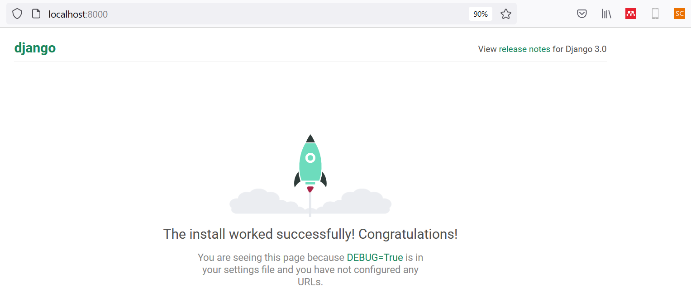
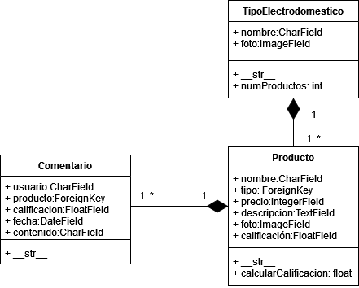
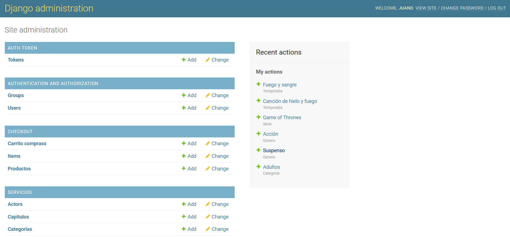

<div align="center">
    <h1>TALLER 1</h1>
</div>

## Introducción

Los temas tratados en el presente taller consisten en:

* Creación de proyecto _django_.
* Uso de aplicaciones.
* Desarrollo de modelos CRUD.
* Creación y uso de serializadores.
* Creación de API's.

Cada punto del taller es dependiente del anterior, por lo que se deberá ir _paso a paso_ para completar cada uno de los puntos.

El tema base del taller es la creación del Backend básico de una plataforma de comercio electrónico de electrodomésticos.

## 1. Creación del proyecto

Crea el proyecto django en una ubicación de interés mediante el comando `django-admin startproject ExEcommerce`.

Para probar la correcta instalación, ejecuta el servidor local con `python manage.py runserver`.

La correcta instalación se debería mostrar en el navegador (dirección: localhost:8000).



## 2. Aplicación _productos_

El siguiente paso consiste en crear la aplicación `Productos` del proyecto y su configuración en `settings.py`.

---

__Aplicación:__ hacemos referencia de aplicación a una _porción_ del proyecto django que se compone de: modelos, serializadores, urls y _views_.

---

## 3. Modelos CRUD

Construye los modelos CRUD de los productos. Tienes la libertad de elegir la estructura final. Puedes guiarte del diagrama UML.

<div align="center">



</div>

Como se aprecia en el esquema, una posible solución sería crear tres clases: `TipoElectrodomestico`, `Producto` y `Comentario`.

---

__CRUD:__ cuando hablamos de este concepto, nos referimos a la conexión a base de datos desde nuestro desarrollo de software. Se trata del acrónimo _crear, leer, actualizar_ y _borrar_, por sus siglas en inglés.

---


## 4. Administración de los modelos CRUD

Para la administración manual del CRUD, debes registrar los modelos en `admin.py`, dentro de la carpeta del proyecto para poder manipular la información desde __localhost:8000/admin__




## 5. Serializadores

Elabora los serializadores de los modelos CRUD. Lo primero que debes hacer es crear el archivo `serializers.py` en la ruta de la aplicación (debería quedar Productos/serializers.py); dirección en dónde se almacenarán los serializadores de la aplicación `Productos`.


---
__Serializador:__ herramienta que convierte un objeto (también llamado: _instancia de una clase_) en un diccionario Python. Se utiliza para comunicar el backend con el frontend a través de API's.

---

## __RESUMEN DE COMANDOS__

### Comandos generales - configuración

* Creación del proyecto django: `django-admin startproject <nomProyecto>`

* Ejecutar el servidor local: `python manage.py runserver`

* Crear aplicación: `python manage.py startapp <nomApp>`

* Añadir aplicación en `settings.py`:

```
INSTALLED_APPS = [
    ...,
    '<nomApp>'
]
```

* Ejecutar migraciones: `python manage.py makemigrations` y `python manage.py migrate`

* Desarrollo de pruebas de lógica CRUD y del proyecto django en general: `python manage.py shell`

* Configuración de la librería `rest_framework` en `settings.py`:

```
INSTALLED_APPS = [
    ...,
    'rest_framework',
    'rest_framework.authtoken'
]

REST_FRAMEWORK = {
    'DEFAULT_AUTHENTICATION_CLASSES': [
        'rest_framework.authentication.BasicAuthentication',
        'rest_framework.authentication.SessionAuthentication',
    ]
}

```

### Modelos del proyecto - CRUD

* `models.Model` permite la creación de las tablas SQL a través de clases de Python. Se emplea durante relaciones de herencia.

* `models.CharField(max_length= <int>)` se emplea para la creación de atributos de tipo texto. Permite especificar la cantidad de caracteres.

* `models.IntegerField()` se utiliza para el almacenamiento de valores numéricos. Sólo números enteros.

* `models.FloatField()` permite almacenar números decimales.

* `models.ImageField()` se emplea para guardar imágenes y fotografías.

* `models.FileField()` se utiliza para guardar cualquier tipo de archivo (video, audio, pdf, word, etc).

* `models.ForeignKey(<nomClaseModelo>, on_delete=models.CASCADE)` sirve para crear conexión entre tablas SQL y entre objetos CRUD.

* `models.ManyToManyField(<nomClaseModelo>)` se emplea para registrar conexiones entre múltiples tablas SQL y objetos CRUD de Python.

### Administración CRUD manual

Para el registro de modelos en la sección de _django-admin_ (localhost:8000/admin), debes hacer lo siguiente en `admin.py`:

```
from django.contrib import admin

from <nomApp>.models import *

admin.site.register(<nomClaseModelo>)
...

```

Para crear usuarios de tipo administrador, debes ejecutar: `python manage.py createsuperuser`

### Serializadores

* `from rest_framework import serializers` importa los serializadores al proyecto.
* `serializers.Serializer` permite crear un serializador básico. Se emplea en relaciones de _herencia_.
* `serializers.ModelSerializer` crea serializadores con base en los modelos del proyecto. Se emplea en relaciones de _herencia_.
* `serializers.CharField()` se emplea para atributos de tipo texto a serializar.
* `serializers.IntegerField()` permite serializar atributos de tipo entero.
* `serializers.FloatField()` serializa atributos de números decimales.

Ejemplo _ModelSerializer_:

```
from rest_framework import serializers

from Productos.models import *

class TipoSerial(serializers.ModelSerializer):
    class Meta:
        model = TipoElectrodomestico
        fields = '__all__'
        #fields = ["nombre", "foto"]
```

### Resumen CRUD - `shell`

```
from <nomApp>.models import *

#OBTENCIÓN DE DATOS
todosObjsCRUD = <nomClase>.objects.all()

objsCRUD = <nomClase>.objects.filter(<nomAtributo> = <valor>)

objCRUD = <nomClase>.objects.get(<nomAtributo> = <valor>)

#CREACIÓN DE DATOS SQL 

nuevoObj = <nomClase>.objects.create(<nomAtributo1> = <valor>, ...)

#PROBAR SERIALIZADOR
from <nomApp>.serializers import *

Televisores = TipoElectrodomestico.objects.get(nombre="Televisores")

telSerial = TipoSerial(Televisores)

telSerial.data

```

### Errores comunes

* `ImportError: No module named PIL`. Solución: instalar la librería mediante `python -m pip install Pillow`.
* `no such table: ...` no hay registro de tabla SQL. Solución: correr las migraciones `python manage.py makemigrations` y `python manage.py migrate`
