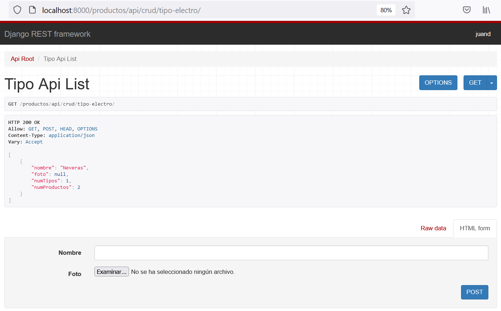

<div align="center">
    <h1>TALLER 1</h1>
</div>

## Introducción

Los temas tratados en el presente taller consisten en:

* Creación de proyecto _django_.
* Uso de aplicaciones.
* Desarrollo de modelos CRUD.
* Creación y uso de serializadores.
* Creación de API's.

Cada punto del taller es dependiente del anterior, por lo que se deberá ir _paso a paso_ para completar cada uno de los puntos.

El tema base del taller es la creación del Backend básico de una plataforma de comercio electrónico de electrodomésticos.

## 1. Creación del proyecto

Crea el proyecto django en una ubicación de interés mediante el comando `django-admin startproject ExEcommerce`.

Para probar la correcta instalación, ejecuta el servidor local con `python manage.py runserver`.

La correcta instalación se debería mostrar en el navegador (dirección: localhost:8000).


## 2. Aplicación _productos_

El siguiente paso consiste en crear la aplicación `Productos` del proyecto y su configuración en `settings.py`.

---

__Aplicación:__ hacemos referencia de aplicación a una _porción_ del proyecto django que se compone de: modelos, serializadores, urls y _views_.

---

## 3. Modelos CRUD

Construye los modelos CRUD de los productos. Tienes la libertad de elegir la estructura final. Puedes guiarte del diagrama UML.

<div align="center">


</div>

Como se aprecia en el esquema, una posible solución sería crear tres clases: `TipoElectrodomestico`, `Producto` y `Comentario`.

---

__CRUD:__ cuando hablamos de este concepto, nos referimos a la conexión a base de datos desde nuestro desarrollo de software. Se trata del acrónimo _crear, leer, actualizar_ y _borrar_, por sus siglas en inglés.

---


## 4. Administración de los modelos CRUD

Para la administración manual del CRUD, debes registrar los modelos en `admin.py`, dentro de la carpeta del proyecto para poder manipular la información desde __localhost:8000/admin__


## 5. Serializadores

Elabora los serializadores de los modelos CRUD. Lo primero que debes hacer es configurar la librería `rest_framework` en `settings.py`. Luego, debes crear el archivo `serializers.py` en la ruta de la aplicación (debería quedar Productos/serializers.py); dirección en dónde se almacenarán los serializadores de la aplicación `Productos`.

---
__Serializador:__ herramienta que convierte un objeto (también llamado: _instancia de una clase_) en un diccionario Python. Se utiliza para comunicar el backend con el frontend a través de API's.

---

## 6. Creación de API's

Una vez creados los serilizadores, estamos listos para crear nuestra primer API. Todas las API's se almacenarán en `views.py` y tendrán una dirección dentro del proyecto (o sea: una __url__). Es por ello que lo primero que debemos crear es un archivo en dónde almacenar las urls de nuestras API's. Ese archivo normalmente adopta el nombre de `urls.py`, y lo creamos __dentro de la carpeta__ de nuestra aplicación 'Productos' (Productos/urls.py).

De esta forma, nuestra aplicación presenta la siguiente estructura:

```
└─── Productos
|       |    __init__.py
|       |    admin.py
|       |    apps.py
|       |    models.py
|       |    serializers.py
|       |    tests.py
|       |    urls.py
|       |    views.py
```

---

__API:__ medio de comunicación entre componentes de software; para nuestro caso: backend y frontend. Utiliza el formato JSON. En django requiere de diccionarios Python, obtenidos a través de la serialización de objetos CRUD, normalmente.

---

### 6.1. _views.py_

Dentro de `views.py` crearemos nuestras API's. Existen __dos__ librerías estándar con las cuales crearlas: `APIView` o `ViewSet`. En el siguiente cuadro resumen podremos entender en qué momento usar una u otra.

<div align="center">

| Argumento | _APIView_ | _ViewSet_ |
| --------- | ------- | -------- |
| __¿Qué es?__ |  <div style="width:150px">Utiliza los métodos de petición de usuario, permitiendo así un __control preciso de la lógica__ del API. Permite utilizar archivos locales y otras API.</div> | <div style="width:150px">Está enfocada en simplificar el proceso de __manipulación de datos__ a través de comandos CRUD.</div> |
| __Métodos base__ | <div style="width:150px">get, post, put, patch y delete.</div> | <div style="width:150px">list, create, retrieve, update, partial_update y destroy.</div> |
| __¿Cuándo utilizarlo?__ | <div style="width:150px">Cuando se busca aplicar una lógica particular con la información recibida del frontend.</div> | <div style="width:150px">Cuando se busca mostrar, crear, actualizar o borrar información.</div> |

</div>

Para cumplir las necesidades de nuestra aplicación, utilizaremos los _ViewSets_ para la creación de nuestras primeras API's. 

Como ejemplo, se mostrará la forma en cómo se podría crear la API de los objetos `TipoElectrodomestico`. Para ello, utilizaremos una librería derivada de `ViewSet` llamada `ModelViewSet`. Esta librería sólo requiere de dos argumentos para la renderización de la información de la API, que son: la clase de serialización, mediante el atributo `serializer_class`, y la información a renderizar, a través del atributo `queryset`.

```
from rest_framework import viewsets

from Productos.serializers import *

class TipoElectroAPI(viewsets.ModelViewSet):
    serializer_class = TipoSerial
    queryset = TipoElectrodomestico.objects.all()
```

La clase `TipoElectroAPI` se trata de una API resumida que permite, desde el frontend, acceder a toda la información registrada en base de datos (serializada mediante la clase `TipoSerial`). Esta API sólo nos permite listar y crear nueva información. Si deseamos tener un _mayor control_ sobre las acciones CRUD desde la API podemos utilizar la clase `ViewSet`, como se muestra a continuación:

```
from rest_framework import viewsets
from rest_framework.response import Response
from django.shortcuts import get_object_or_404
from rest_framework import status

from Productos.serializers import *

class TipoElectroAPI(viewsets.ViewSet):
    def list(self, request):
        tipos = TipoElectrodomestico.objects.all()
        serializer = TipoSerial(tipos, many=True) 
        return Response(serializer.data)
    
    def retrieve(self, request, pk=None):
        tipos = TipoElectrodomestico.objects.all()
        tipo = get_object_or_404(tipos, id=pk)
        serializer = TipoSerial(tipo)
        return Response(serializer.data)
    
    def create(self, request):
        serializer = TipoSerial(data=request.data)
        if serializer.is_valid():
            serializer.save()
            return Response({"Creado":True})
        return Response(serializer.errors, status=status.HTTP_400_BAD_REQUEST)
```

### 6.2. _urls.py_ - aplicación 'Productos'

En esta sección, registraremos las rutas en donde se podrá establecer la comunicación entre el backend y el frontend. Al trabajar con `ViewSet`, tendremos que registrar nuestras rutas a través de un `router`, como se muestra a continuación:

```
from django.urls import path, include
from rest_framework.routers import DefaultRouter

from Productos.views import *

router = DefaultRouter()
router.register('tipo-electro', TipoElectroAPI)


urlpatterns = [
    path('crud/', include(router.urls))
]
```

Las rutas incluidas se tratan de rutas __locales__; por lo que es necesario proceder a un último paso antes de probar las API's.

### 6.3. _urls.py_ - proyecto

Ahora que ya están listas las direcciones locales, debemos agregarlas a las direcciones del proyecto de la siguiente forma:

```
from django.contrib import admin
from django.urls import path, include

urlpatterns = [
    path('admin/', admin.site.urls),
    path('productos/api/', include('Productos.urls'))
]
```

### 6.4. Pruebas

En este punto, podemos hacer pruebas de acceso y de creación de objetos desde las API's. Sólo debemos acceder a la dirección de una API. Para nuestro ejemplo, la dirección sería: __localhost:8000/productos/api/crud/tipo-electro__


