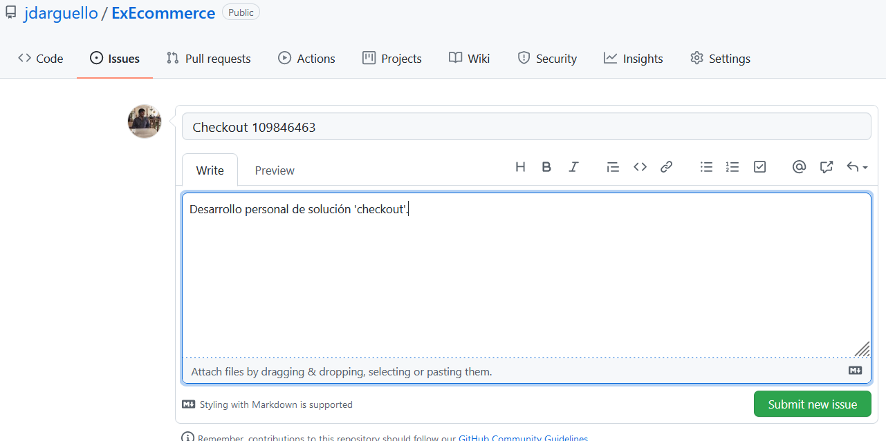
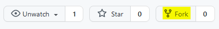

    <h1>Taller 2</h1>

## Introducción

El presente taller se centra en repasar los siguientes conceptos:

* Trabajo con proyectos existentes.
* Creación de modelos CRUD.
* Uso, creación y adaptación de serializadores.
* Creación de API's.
* Trabajo con _forks_ y ramas de trabajo de individual.
* _Pull request_ e _issues_.

Para la solución del taller, debes tener en cuenta que cada punto es dependiente del anterior; por lo que deberás ir _paso a paso_.

El tema base de este taller será la lógica básica del __checkout__ de una plataforma de comercio electrónico enfocada en la venta de electrodomésticos.

## 1. Repositorio oficial

Puedes acceder al repositorio oficial de este taller a través haciendo click [aquí](https://github.com/jdarguello/ExEcommerce). En este repositorio debes hacer lo siguiente:

1. Crea un _issue_ personal tuyo en el proyecto. Debes titularlo: __"Checkout #cedula"__; por ejemplo: "Checkout 109846463".

__No olvides escribir el número del _issue_ que acabas de crear__.

2. Crea una copia (_fork_) del proyecto en tu cuenta personal.

 

## 2. Repositorio local

Ahora, crearás un clon del _repositorio oficial_, en la ubicación que desees, mediante el comando: `git clone https://github.com/jdarguello/ExEcommerce`

Dentro de la ubicación del repositorio local, ejecutarás los siguientes comandos:

1. `git remote add fork <url_fork>`. El `<url_fork>` se trata del url del repositorio copia que tienes en tu cuenta de GitHub.
2. `git checkout -b checkout_<cedula>`. Vas a crear una rama de trabajo personal. En `<cedula>` digitarás tu número de cédula. 

En este punto, ya estás listo para trabajar en el proyecto.

## 3. Aplicación _checkout_

Ahora, crearás una aplicación del proyecto django bajo el nombre __"checkout-#cedula"__. Es importante que coloques tu número de identificación para que al hacer el _pull request_ no haya conflicto al añadirlo al repositorio oficial. Recuerda también hacer la configuración en `settings.py`.

## 4. Modelos CRUD

Construye los modelos CRUD para el checkout de la plataforma. Puedes guiarte del diagrama UML.

## 5. Serializadores

Construye los serializadores del proyecto.

## 6. API's

Crea las API's con base en la información que deseas que tus usuarios observen en el frontend.

## 7. Actualizar proyecto

Una vez hayas terminado, sube el contenido a tu repositorio copia de la siguiente forma:

1. `git add .`
2. `git commit -m "Fixes #<numIssue> <mensaje>`. El `<numIssue>` hace referencia al issue que abriste al principio del proyecto y el `<mensaje>` al mensaje adicional que desees escribir.
3. `git push fork checkout_<cedula>`. Recuerda que `checkout_<cedula>` corresponde al nombre de la rama de trabajo que estás utilizando. Para mirar las ramas de trabajo, sólo debes escribir `git branch`. En este punto, ya subiste el contenido a tu repositorio copia.
4. Dirígete a tu cuenta de GitHub, al repositorio copia y solicita un _pull request_.