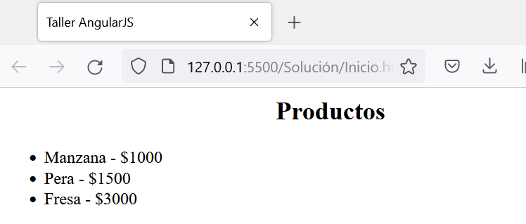
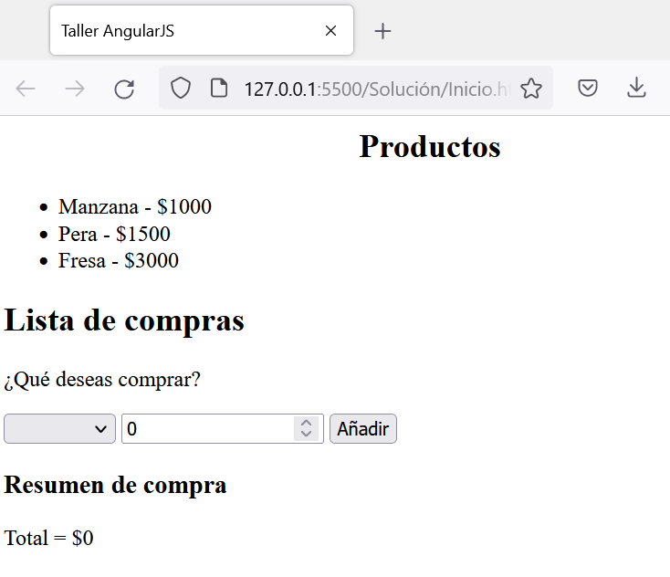

<div align="center">
    <h1>Taller AngularJS</h1>
</div>

## Problema

Tienes un desarrollo en JavaScript con la base de datos de los productos ofrecidos en tu plataforma de comercio electrónico. Construye un desarrollo interactivo, tipo SPA, que emule la lógica de un carrito de compras.

## 1. Generalidades

Para el inicio de la construcción de la solución, debemos empezar con la construcción de la base. Para ello, se construye la solución con base en los siguientes directorios:

```
AngularJS   
│   Inicio.html
|   estilos.css
|   App.js
```

### 1.1. HTML

```HTML
<html ng-app="Checkout">
    <head>
        <title>Taller AngularJS</title>
        <script src="https://ajax.googleapis.com/ajax/libs/angularjs/1.8.2/angular.min.js"></script>
        <link rel="stylesheet" href="estilos.css">
        <script src="App.js"></script>
    </head>
    <body ng-controller="control as data">
        
    </body>
</html>
```

En el documento HTML, se pueden apreciar tres cambios genéricos:

* Por un lado, se importó AngularJS a través de la etiqueta <code>script</code>.
* Por otro, se inicializa en la etiqueta <code>html</code>, mediante el argumento `ng-app`.
* Se importan los estilos css, pero además, se importa también un archivo JavaScript personalizado en done se especifica la lógica general de nuestro desarrollo.

En este punto, es posible utilizar AngularJS en nuestro desarrollo.

### 1.2. App.js

Se trata de un archivo en JavaScript que contiene todas las variables y funciones del desarrollo lógico que se desea implementar. AngularJS se basa en el Modelo Vista Controlador (MVC), por lo que todas las operaciones de control se ejecutarán en este archivo. Para dar inicio, el cuerpo de <code>App.js</code> será:

```JS
angular.module('Checkout', [])
    .controller('control', function() {
        
    });
```
En esta sección, se especifica el nombre de la vista como `Checkout` y la del controlador como `control`. 

## 2. Base de datos

Para la ejecución del checkout, es necesario tener una base de datos de los artículos que se venderán junto con sus precios.

### 2.1. App.js

Empezaremos creando la lista manual de artículos a vender:

```JS
angular.module('Checkout', [])
    .controller('control', function() {
        var c = this;
        c.productos = [
            {nombre:"Manzana", precio:1000},
            {nombre:"Pera", precio:1500},
            {nombre:"Fresa", precio:3000}
        ];
    });
```

### 2.2. HTML

En el cuerpo del documento, listaremos los elementos que se venden en la plataforma. Para ello:

```HTML
<body ng-controller="control as data">
    <h2 align="center">Productos</h2>
    <ul>
        <li ng-repeat="prod in data.productos">{{prod.nombre}} - ${{prod.precio}}</li>
    </ul>
</body>
```

Lo que nos dará como respuesta:



## 3. Compra

Para el desarrollo de la compra, construiremos una lista de selección para que el usuario escoja el producto, defina la cantidad y la agregue al carrito. 

### 3.1. HTML

Añadiremos dentro del <code>body</code>, al final:

```HTML
<h2>Lista de compras</h2>
<p>¿Qué deseas comprar?</p>
<form ng-submit="data.addProd()">
    <select ng-model="data.art">
        <option ng-repeat="prod in data.productos" value="{{prod.nombre}}">{{prod.nombre}}</option>
    </select>
    <input type="number" ng-model="data.cant" placeholder="0">
    <input class="btn-primary" type="submit" value="Añadir">
</form>
<h3>Resumen de compra</h3>
<ul>
    <li ng-repeat="prod in data.listaCompras">
        <p>{{prod[0]}} - {{prod[1]}} - ${{prod[3]}}</p>
    </li>
</ul>
<p>Total = ${{data.total}}</p>
```

Para el resumen de compra, se debe almacenar los valores en una lista (para este caso: `data.listaCompras`) y efectuar el desarrollo de la aplicación a través de un formulario en donde se solicite el _producto_ a comprar y la _cantidad_.

### 3.2. App.js

```JS
angular.module('Checkout', [])
    .controller('control', function() {
        var c = this;   //Nombre del contenido
        c.productos = [
            {nombre:"Manzana", precio:1000},
            {nombre:"Pera", precio:1500},
            {nombre:"Fresa", precio:3000}
        ];

        //Variables de compra
        c.listaCompras = [];
        c.art = "";
        c.cant = 0;
        c.total = 0;

        //Retorno del diccionario del producto
        function proData(nombre) {
            for (var i=0; i< c.productos.length; i++) {
                if (c.productos[i].nombre == nombre) {
                    return c.productos[i];
                }
            }
        }

        //Función de adición al carrito
        c.addProd = function() {
            var artData = proData(c.art);
            c.listaCompras.push([artData.nombre, c.cant, artData.precio, c.cant*artData.precio]);
            c.total += c.cant*artData.precio;
            c.art={};
            c.cant=0;
        };
    });
```

Finalmente, el resultado final se puede apreciar a continuación:




