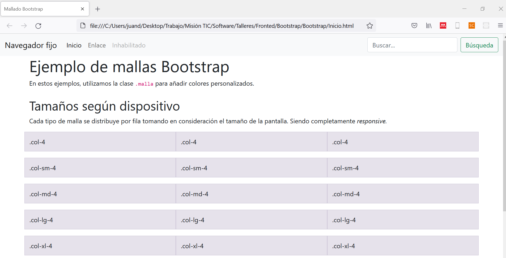
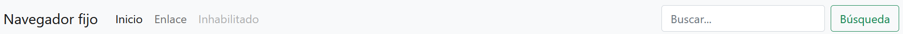
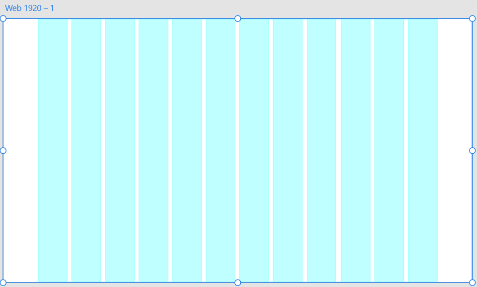
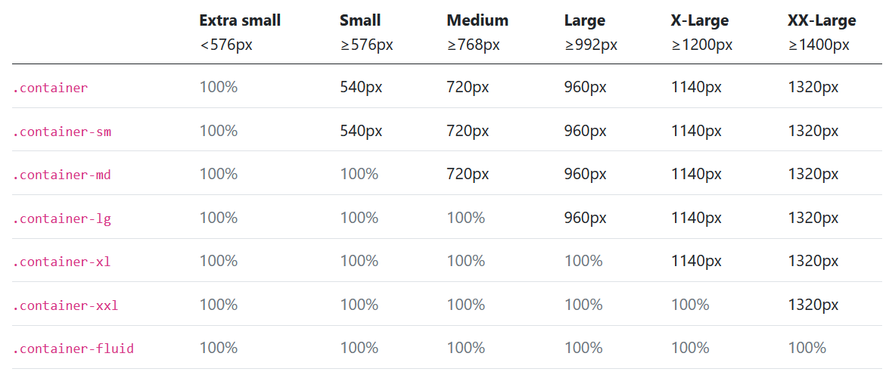

<div align="center">
    <h1>Taller Bootstrap</h1>
</div>

## Introducción 

Bootstrap es un framework de frontend que facilita la construcción estética y funcional de una aplicación web _responsive_. Con el presente taller, aprenderemos cómo hacer la construcción de una página con esta herramienta.


## 1. Problema

Crearemos el siguiente sistema de mallado:



## 2. Generalidades

Antes de empezar a construir el documento, debemos preparar el _espacio de trabajo_. El desarrollo del presente taller debe hacerse en una nueva carpeta, podría llamarse, por ejemplo, <code>TallerB</code>, que contendra:

```
TallerB   
│   Inicio.html
|   estilos.css
```

### 2.1. Cabecera HTML

Para la construcción del documento html, empezamos desarrollando el <code>head</code> que contendrá las importaciones de Bootstrap y de nuestros estilos personalizados.

```HTML
<html>
  <head>
    <meta charset="utf-8">
    <meta name="viewport" content="width=device-width, initial-scale=1">
    <title>Mallado Bootstrap</title>    

    <link href="https://cdn.jsdelivr.net/npm/bootstrap@5.1.1/dist/css/bootstrap.min.css" rel="stylesheet" integrity="sha384-F3w7mX95PdgyTmZZMECAngseQB83DfGTowi0iMjiWaeVhAn4FJkqJByhZMI3AhiU" crossorigin="anonymous">

    <link rel="stylesheet" href="estilos.css">
  </head>
  <body>

  </body>
</html>
```

## 3. Navegador

El navegador que se construirá contiene los siguientes elementos:



Usando Bootstrap, minimizamos la creación específica de clases e id's en css. Por lo cual, sólo tendremos que crear el navegador en HTML utilizando las <b>clases de Bootstrap</b>, como se muestra a continuación:

```HTML
<nav class="navbar navbar-expand-md navbar-light fixed-top bg-light">
    <div class="container-fluid">
        <a class="navbar-brand" href="#">Navegador fijo</a>
        <button class="navbar-toggler" type="button" data-bs-toggle="collapse" data-bs-target="#navbarCollapse" aria-controls="navbarCollapse" aria-expanded="false" aria-label="Toggle navigation">
        <span class="navbar-toggler-icon"></span>
        </button>
        <div class="collapse navbar-collapse" id="navbarCollapse">
        <ul class="navbar-nav me-auto mb-2 mb-md-0">
            <li class="nav-item">
            <a class="nav-link active" aria-current="page" href="#">Inicio</a>
            </li>
            <li class="nav-item">
            <a class="nav-link" href="#">Enlace</a>
            </li>
            <li class="nav-item">
            <a class="nav-link disabled">Inhabilitado</a>
            </li>
        </ul>
        <form class="d-flex">
            <input class="form-control me-2" type="search" placeholder="Buscar..." aria-label="Search">
            <button class="btn btn-outline-success" type="submit">Búsqueda</button>
        </form>
        </div>
    </div>
</nav>
```

1. Iniciamos con la etiqueta <code>nav</code>:

```HTML
<nav class="navbar navbar-expand-md navbar-light fixed-top bg-light">

</nav>
```

* <code>navbar</code> permite la adaptabilidad general de la barra de navegación.
* <code>navbar-expand-md</code> estipula que la barra ocupe todo el espacio horizontal de la pantalla para tamaños mayores a los 992px.
* <code>navbar-light</code> adapta los colores base de fuentes del navegador.
* <code>fixed-top</code> permite que el navegador permanezca __siempre__ en la parte superior de la pantalla: accesible para el usuario.
* <code>bg-light</code> estipula un fondo de pantalla claro.

2. Establecemos los elementos del navegador dentro de un <code>div</code>:

```HTML
<div class="container-fluid">

</div>
```

* <code>container-fluid</code> organiza los elementos con un espaciado preciso y simétrico.

3. Establecemos el __título__ del navegador con la etiqueta `a`:

```HTML
<a class="navbar-brand" href="#">Navegador fijo</a>
```
* <code>navbar-brand</code> identifica al título principal del navegador.

4. Botón de _expansión_ de menú:

```HTML
<button class="navbar-toggler" type="button" data-bs-toggle="collapse" data-bs-target="#navbarCollapse" aria-controls="navbarCollapse" aria-expanded="false" aria-label="Toggle navigation">
<span class="navbar-toggler-icon"></span>
</button>
```

Botón _"invisible"_ que aparece cuando el tamaño de pantalla es menor a los 576px.

5. Opciones de menú:

```HTML
<ul class="navbar-nav me-auto mb-2 mb-md-0">
    <li class="nav-item">
        <a class="nav-link active" aria-current="page" href="#">Item...</a>
    </li>
    ...
</ul>
```

* <code>navbar-nav</code> hace referencia a las opciones de navegación.
* <code>me-auto</code> establece un márgen automático de espaciamiento entre opciones.
* <code>mb-2</code> establece un espaciamiento adicional tipo _padding_.
* <code>nav-item</code> estipula un item de navegación.
* <code>nav-link</code> estilo de hipervínculo a una sección de navegación.

6. Menú de búsqueda:

```HTML
<form class="d-flex">
    <input class="form-control me-2" type="search" placeholder="Buscar..." aria-label="Search">
    <button class="btn btn-outline-success" type="submit">Búsqueda</button>
</form>
```

Se trata de un formulario que permite la comunicación con backend. 

## 4. Sistema de mallado

Para el establecimiento del sistema de mallado, Bootstrap cuenta con diferentes clases css para estipular el tamaño horizontal de la malla. 

La clave está en que Bootstrap, independientemente del tamaño de pantalla, divide el espacio de trabajo en __12 secciones verticales__, como se muestra a continuación:



El diseño responsive se basa en manejar diferentes números de secciones dependiendo del tamaño de pantalla. Este número puede ser variable dependiendo de cada pantalla.

Bootstrap toma en consideración los siguientes tamaños de pantalla:



<p align="center"><i>Fuente:</i> Bootstrap.</p>

### 4.1. Mallado genérico - independiente del tamaño

```HTML
<div class="row mb-3">
    <div class="col-4 malla">.col-4</div>
    <div class="col-4 malla">.col-4</div>
    <div class="col-4 malla">.col-4</div>
</div>
```
Esta malla ocupará cuatro secciones independientemente del tamaño de pantalla.

### 4.2. Mallado _sm_

```HTML
<div class="row mb-3">
    <div class="col-sm-4 malla">.col-4</div>
    <div class="col-sm-4 malla">.col-4</div>
    <div class="col-sm-4 malla">.col-4</div>
</div>
```

Dispositivos mayores a los 576px tendrán tres columnas de 4 secciones verticales cada una.

### 4.2. Mallado _md_

```HTML
<div class="row mb-3">
    <div class="col-md-4 malla">.col-4</div>
    <div class="col-md-4 malla">.col-4</div>
    <div class="col-md-4 malla">.col-4</div>
</div>
```

Dispositivos mayores a los 768px tendrán tres columnas de 4 secciones verticales cada una.