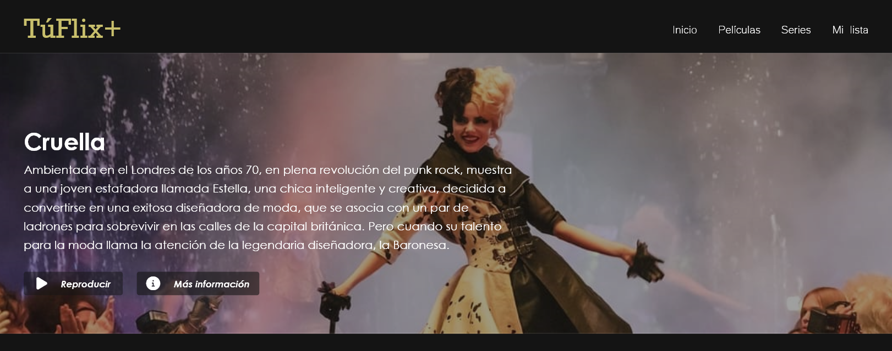
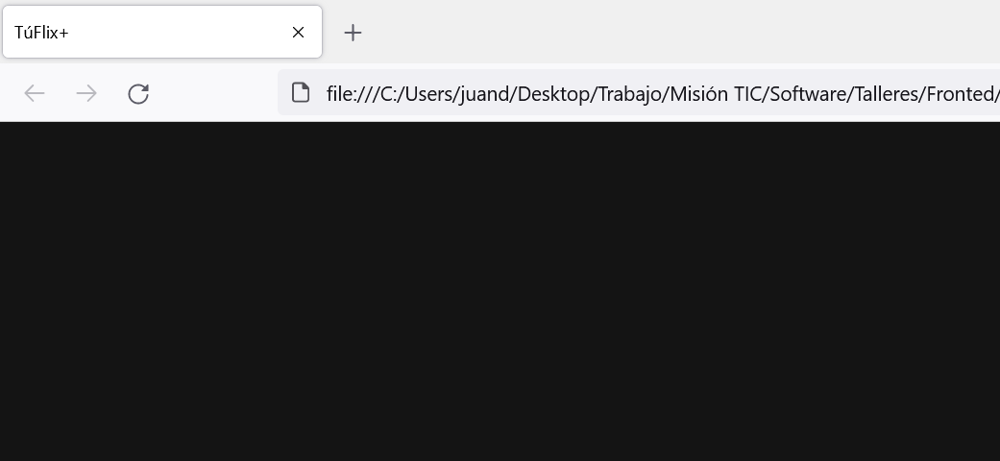
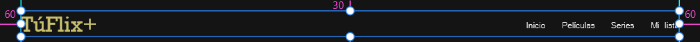
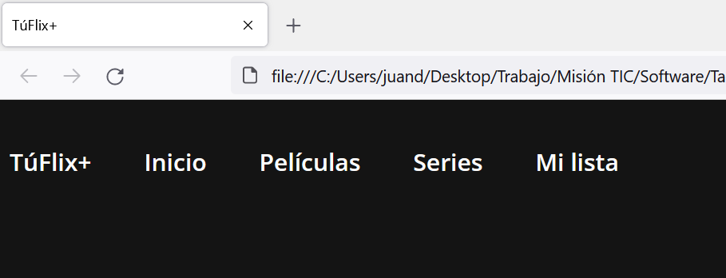
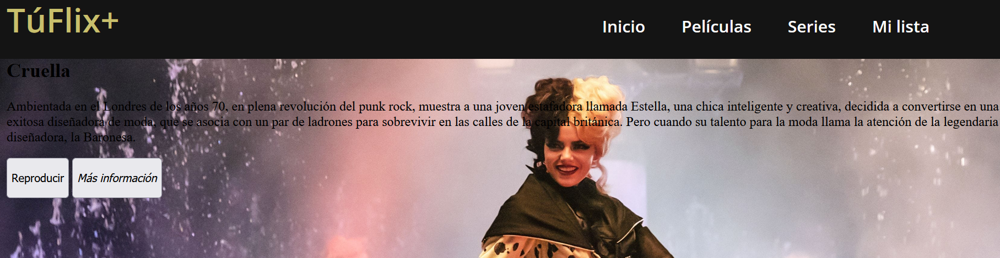
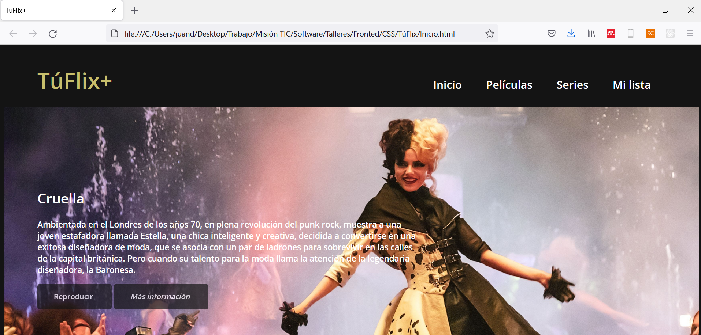

<div align="center">
    <h1>Taller CSS</h1>
</div>

## Introducción

El lenguaje de estilos _css_ define la estética de los documentos HTML. Normalmente, suele emplearse como archivo externo para proyectos complejos. El primer paso del desarrollo frontend consiste en el construcción de prototipos mediante herramientas de diseño, como Adobe XD, para luego plasmar, paso a paso, el diseño en HTML y css. Para este caso, tomaremos parte de un prototipo y lo construiremos _paso a paso_.

## 1. Problema

Para el presente taller, construiremos parte del desarrollo visual de la plataforma _TúFlix+_, como se aprecia a continuación:



## 2. Generalidades

Lo primero que debemos hacer para crear nuestra interfaz, con HTML y css, es crear una carpeta en dónde guardar todo el desarrollo. Podríamos llamarla `TuFlix`, siguiendo con la siguiente estructura:

```
TuFlix   
│   Inicio.html
|   estilos.css
└───Images
|   └───cruella.jpg
```

La construcción del frontend se hará _en paralelo_ entre `Inicio.html` y `estilos.css`. 

### 2.1. HTML

Lo primero que haremos será construir el HTML de forma genérica y conectado con `estilos.css`:

```HTML
<html>  
    <head>
        <title>TúFlix+</title>
        <link rel="stylesheet" href="estilos.css">
    </head>
    <body>
           
    </body>
</html>
```

La respuesta obtenida en este punto será un documento en blanco con el título del proyecto. El desarrollo posterior se realizará en la zona del __body__ del documento HTML.

### 2.2. css

Empezaremos dando el fondo negro característico, de referencia HEX #141414.

```CSS
body {
    background-color: #141414;
}
```

El resultado obtenido será:



## 3. Cabecera

Empezaremos construyendo la cabecera del frontend, que normalmente es la que se preserva en los demás documentos, conocido también como el menú de navegación.



Como se aprecia, las dimensiones externas de la cabecera son: 60px en el sentido horizontal y 30px en el sentido vertical; para un diseño 1920x1080 pixeles. Para los textos, importaremos estilos de __Google Fonts__ en la sección `head` de nuestro archivo HTML, de la siguiente forma:

```HTML
<head>
    <title>TúFlix+</title>
    <link rel="stylesheet" href="estilos.css">
    <link rel="preconnect" href="https://fonts.googleapis.com">
    <link rel="preconnect" href="https://fonts.gstatic.com" crossorigin>
    <link href="https://fonts.googleapis.com/css2?family=Open+Sans:wght@600&display=swap" rel="stylesheet"> 
</head>
```

### 3.1 HTML

La cabecera se trata del menú de navegación del aplicación web. En cuanto al HTML, definimos ese menú de la siguiente forma:

```HTML
<nav>
    <a class="Logo" href="">TúFlix+</a>
    <a href="">Inicio</a>
    <a href="">Películas</a>
    <a href="">Series</a>
    <a href="">Mi lista</a>
</nav>
```

El resultado se puede apreciar a continuación:


### 3.2. Opciones de navegación

Iniciaremos definiendo los estilos del menú de navegación de la plataforma, tomando en cuenta las siguientes consideraciones:

* Color de letra: blanco.
* Tipo de letra: Open sans.
* Tamaño de letra: 20px.
* Espaciamiento: 40px.

De este modo:

```CSS
nav {
    padding-top: 30px;
}

a {
    color: white;
    text-decoration: none;
    font-family: 'Open Sans', sans-serif;
    font-size: 20px;
    padding-right: 40px;
}

a:hover {
    text-decoration: underline;
}
```
Visualmente, obtenemos el siguiente resultado:



### 3.3. Logo

Para el logo, se destaca la siguiente información:

* Color de letra (HEX): #C8BF6C
* Tipo de letra: Open sans.
* Tamaño de letra: 40px.
* Distanciamiento con menú: 580px.

```CSS
.Logo {
    font-size: 40px;
    color: #C8BF6C;
    padding-left: 60px;
    padding-top: 100px;
    padding-right: 580px;
}

.Logo:hover {
    text-decoration: none;   
}
```

Como resultado, obtendremos nuestro menú de navegación ordeando y acotado, acorde al prototipo.


## 4. Película principal

La sección de la película principal consistirá en la sección principal de nuestra aplicación web. 


### 4.1. HTML

En el archivo HTML, definiremos el contenido en una sección, mostrando el título principal, la descripción de la película, los botones y el contenido de los botones como se muestra a continuación:

```HTML
<section class="peliP">
    <h1 class="tituloP"><strong>Cruella</strong></h1>
    <p class="contenido">Ambientada en el Londres de los años 70, en plena revolución del punk rock, muestra a una joven estafadora llamada Estella, una chica inteligente y creativa, decidida a convertirse en una exitosa diseñadora de moda, que se asocia con un par de ladrones para sobrevivir en las calles de la capital británica. Pero cuando su talento para la moda llama la atención de la legendaria diseñadora, la Baronesa.</p>
    <div>
        <button><p class="tBoton">Reproducir</p></button>
        <button><p class="tBoton"><i>Más información</i></p></button>
    </div>
</section>
```

El resultado visible se puede apreciar a continuación:


### 4.2. css

Para brindar estilos css, empezaremos por el fondo de pantalla y el alineado del texto, luego personalizaremos el color del texto y los botones.

#### 4.2.1 Fondo de pantalla

Para brindar el fondo de pantalla, añadiremos el fondo de la siguiente forma:

```CSS
section {
    padding-left: 60px;
}

.peliP {
    background-image: url(./Images/curella.jpg);
    background-repeat: no-repeat;
    background-size: 1400px;
    padding-bottom: 80px;
}

```

Que nos dará como resultado:



#### 4.2.2 Texto y botones

Para la personalización del texto y botones:

```CSS
h1 {
    color: white;
    font-family: 'Open Sans', sans-serif;
    font-size: 25px;
}

.tituloP {
    padding-top: 150px;
}

p {
    color: white;
    font-family: 'Open Sans', sans-serif;
}

.contenido {
    font-size: 15px;
    width: 700px;
}

button {
    background-color: #141414;
    opacity: 0.7;
    border-radius: 5px;
    border-width: 0;
    padding-left: 30px;
}

button:hover {
    background-color: rgb(180, 180, 180);
}

.tBoton {
    padding-right: 30px;
}
```

Que nos dará como resultado el objetivo deseado:

