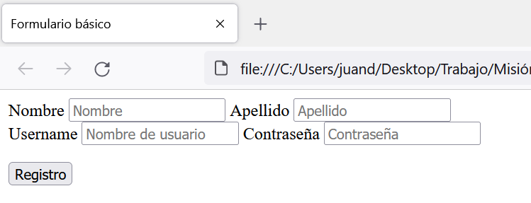

    <h1>Taller 2</h1>

## Introducción

Construye un formulario HTML que permita captar la información de nuevos usuarios para su registro.

## 1. Formulario de registro

Puedes guiarte del siguiente pantallazo para recrear el mismo formulario con comandos HTML.

Para ello, tendrás que usar las etiquetas: `<form></form>`, `

`, `<label></label>` e `<input>`.